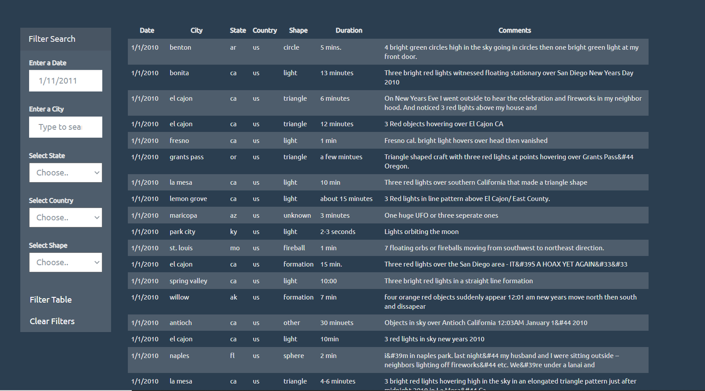
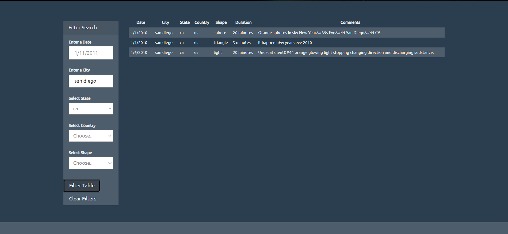

# javascript-challenge

## Introduction

This is my submission for the Javascript Challenge homework.

## Structure
```
|_UFO-level-1
	|_static
		|_css
			|_style.css
		|_images
			|_nasa.jpg
			|_ufo.svg
		|_js
			|_app.js
			|_data.js
	|_index
|_UFO-level-2
	|_static
		|_css
			|_style.css
		|_images
			|_nasa.jpg
			|_ufo.svg
		|_js
			|_app.js
			|_data.js
	|_index
|_.gitignore
|_README.md
|_ufo2.png
|_filters.png


```

## Usage

```

#The pages were created using:
HTML5
CSS W3
Bootstrap 4.3.1
JavaScript ES6
D3.js

```

## Summary


When [UFO 1](https://fernb.github.io/javascript-challenge/UFO-level-1/) or [UFO 2](https://fernb.github.io/javascript-challenge/UFO-level-2/) is loaded the data from the ufo json is rendered into a HTML table using D3.js.




The table from UFO 1 can be filtered by date by typing in a date into the date field and activating the filter function by clicking the filter button.

The table from UFO 2 is filterable by a similar way however can be filtered by date, city, state, country and shape. The state, country and shape fields are selectable as dropdowns from all available options.
The city is selectable by a bootstrap autocomplete list. The options are populated into the HTML using D3.js.



Filter selections can be cleared using the clear filters button which activates the clear function.


